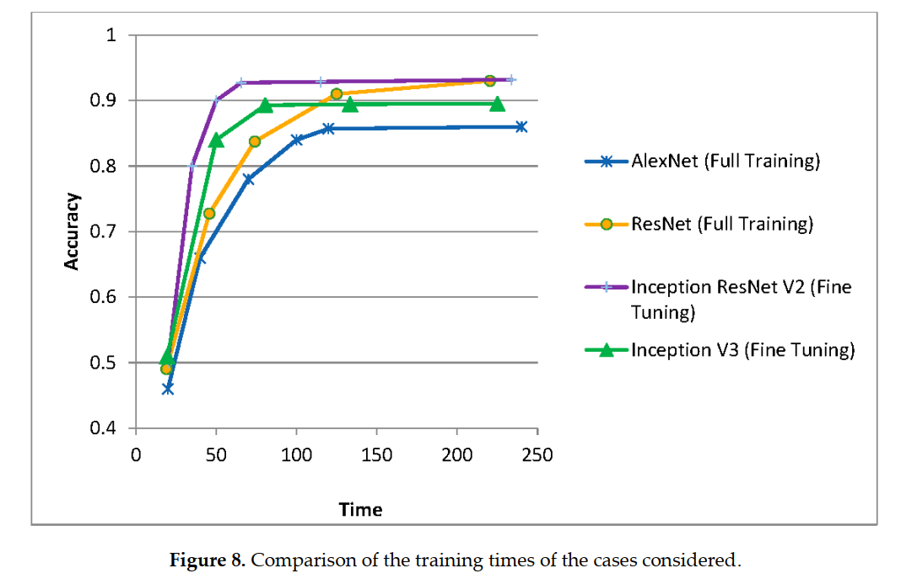

# Applied Deep Learning: Exercise 1 - Initiate

Author: **"Laszlo Kiraly, 09227679"**  
Date: **"10/30/2019"**

---

## Project Idea
The paper [Classification of Architectural Heritage Images Using Deep Learning Techniques](https://www.researchgate.net/publication/320052364_Classification_of_Architectural_Heritage_Images_Using_Deep_Learning_Techniques) brings its own [dataset](https://old.datahub.io/dataset/architectural-heritage-elements-image-dataset) to classify different types of architectural monuments, e.g. gargoyles, inner and outer domes, altars, etc.

The scores for full retrain of a resnet model are:

| Measure | Altar | Apse | Bell Tower | Column | Dome Inner | Dome Outer | Flying Buttress | Gargoyle | Stained Glass | Vault |
|---|---|---|---|---|---|---|---|---|---|---|
| F1 score | 0.906 | 0.874 | 0.903 | 0.953 | 0.967 | 0.937 | 0.805 | 0.923 | 0.990 | 0.925 |

The goal of my project is to beat the F1 Score on at least 6 classes with transfer learning.

## Dataset

The [dataset](https://old.datahub.io/dataset/architectural-heritage-elements-image-dataset) has 10 classes of architectural heritages.
There are 10235 images available from which 80% were taken for training and 20% for validation. The test dataset consists of 1404 elements.
The images dimensions are 128x128 with 8bit RBG in jpg format.

## Work Breakdown
- setup of current cuda environment @home gtx-1080ti (4h)
- check if there is a more current deep neural network trained on images which can be used for transfer learning, if there isn't a usable one use then use one from the paper, e.g. inception v3 (4h)
- get inspiration from [A Survey on Deep Transfer Learning](https://link.springer.com/chapter/10.1007/978-3-030-01424-7_27) and/or [Hands-On Transfer Learning with Python](https://proquest.tech.safaribooksonline.de/9781788831307) and/or [fast.ai](https://www.fast.ai) and/or [tensorflow](https://www.tensorflow.org/hub/tutorials/image_retraining) AND [HRNet]( https://github.com/HRNet/HRNet-Image-Classification)(8h)
- network architecture first draft including F1 score results (8h)
- train, evaluate and fine-tune the network (16h)
- web application for uploading and classifying an image with the latest model in a docker image (4h)
- final report (4h)
- presentation slides (4h)

